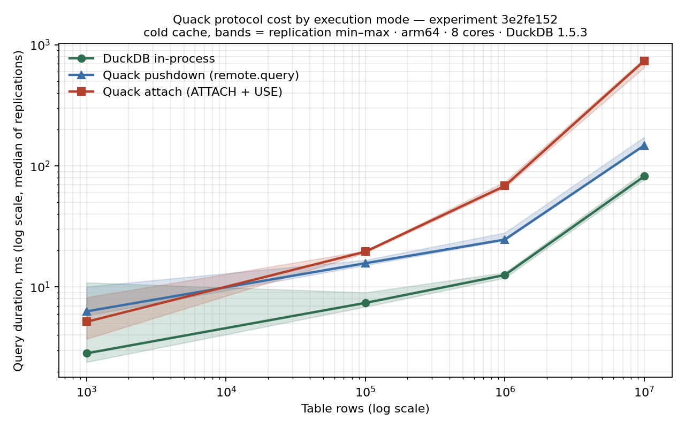

# [WORKING TITLE] Measuring Quack: What DuckDB's New Client-Server Protocol Actually Costs

<!-- ============================================================
     HOW TO USE THIS DRAFT
     - Sections marked [YOURS] are your voice: polished versions of
       what you wrote, or prompts for what only you can say.
     - Sections marked [DRAFTED] are factual/technical: edit freely,
       the numbers and claims are exact and capsule-backed.
     - Everything in <angle quotes> is a placeholder to fill.
     This file is untracked — your scratchpad, not the repo's.
     ============================================================ -->

## Introduction  [YOURS — polished from your draft, edit at will]

In my home, ducks are revered. There is a story arc there deserving of its
own article — perhaps a memoir chapter — and it will have to wait.

On my birthday this year, I received an unusual gift. My friend Joe Reis
hosted a Lunch and Learn on his Practical Data Modeling community, where
Hannes Mühleisen introduced us to Quack: DuckDB's new client-server
protocol. The database the industry loves precisely because it *isn't* a
server had just learned to be one.

The gift wasn't the talk. It was the question I left with: **what does
that network layer actually cost?** Quack is in beta, the announcement
made bold claims, and nobody outside the DuckDB team had published
independent measurements. I happen to own the right instrument.

## The instrument, briefly  [DRAFTED — the "methods box"]

Last year I built a benchmarking laboratory — originally to test my own
hypotheses about SQL engines (PostgreSQL and DuckDB at its core, with
Actian Vector and TypeDB as expansion proofs). It differs from the usual
"dataset + queries + stopwatch" benchmark in one structural way: it
produces **reproducible experiments, not numbers**.

What that means concretely — every result is a **capsule**: a folder you can
open (the IDs below — `3e2fe152`, `45db01a4`, `25ce1385`, `0ee24e68` — are real
directories in the repo, not citations). Two things hold for all of them: how
each number was *produced*, and what each one lets you *verify without trusting
me*.

**How every number is produced**

- **Cold** — before *each individual query*, not each batch, the OS page cache
  is forcibly evicted and the engine reset (containers restarted, servers
  cold-started, connections reopened). Five replications per point, on an
  otherwise idle machine.
- **Seeded** — identical data regenerates from the config; for the TPC-H
  validation, data comes from the official `dbgen`.
- **Orchestrated by Dagster** — every cell of an experiment's matrix is an
  independent asset partition, which is what makes parallel dispatch, granular
  retries, and per-partition lineage possible at all.
- **Whole, not averaged** — the capsule stores the raw per-replication timings
  (not just means) and the bench conditions (engine versions, OS, hardware), so
  the spread is yours to inspect, not mine to summarize.

**What every result lets you verify — without trusting me**

A benchmark you have to take on faith isn't evidence. Each capsule carries four
independent guarantees, every one checkable with a single command:

- **Reproducible** — a content-addressed ID: an 8-character SHA-256 of the
  config, the SQL, and all measurement-relevant code. Reformatting never changes
  it; a logic change always does. Re-run the config and you get the same ID — or
  the comparison is refused by construction.
- **Intact** — an integrity seal (SHA-256 over every file in the capsule). A
  silent edit to any result breaks it.
- **Timestamped** — an OpenTimestamps proof anchoring that seal to the Bitcoin
  blockchain. No one — not me, not GitHub — can backdate or quietly alter a
  published result.
- **Attributed** — the published set is a signed git tag, so you can verify who
  produced it.

And the lab analyzes itself: every row-scaled capsule auto-includes a
`scaling.json` — each engine's power-law exponent, fit from the raw timings and
sealed alongside them. Those exponents become the spine of everything that
follows.

How these guarantees are enforced — the semantic hashing, the isolation
harness, the capsule contract — is an architecture story of its own, and
it's the next article. For this one, you only need to know what the
instrument promises: **every claim below can be checked, re-run, or
proven wrong.**¹

> ¹ *"Proven wrong" is the point. A hypothesis is scientific only if some
> measurement could refute it — Karl Popper called this* falsifiability.
> *You can never prove a hypothesis true (the millionth white swan proves
> nothing); one black swan disproves it decisively. You'll watch one of my
> hypotheses die in this article. That's the instrument working.*

## What Quack is  [DRAFTED — tighten to taste]

Quack (beta in DuckDB 1.5.3, stable planned for v2.0.0 in September)
turns a DuckDB instance into a server other DuckDB instances reach over
HTTP. It offers two ways to execute work remotely:

- **Attach mode**: `ATTACH 'quack:host' AS remote` — remote tables behave
  like local ones; your client plans the queries.
- **Pushdown mode**: `remote.query('SELECT …')` — the SQL text ships to
  the server and executes entirely there.

That distinction sounds like an implementation detail. It is the entire
story.

## Act I — What does the protocol cost? (capsule `3e2fe152`)  [DRAFTED]

One experiment, one query (a 12-row aggregation over a growing table),
three ways of running it: DuckDB in-process (the floor), Quack attach,
Quack pushdown. Scales from 1K to 10M rows.

My hypothesis going in: protocol overhead would *amortize* — connection
and round-trip costs are fixed, so the bigger the scan, the smaller the
protocol's share.

**The data killed it.** Attach-mode overhead *grew* with scan size:

| rows | duckdb | quack attach | quack pushdown |
|---|---|---|---|
| 1K | 4.3 ms | 5.3 ms | 7.1 ms |
| 100K | 7.6 ms | 19.5 ms (2.6×) | 15.7 ms (2.1×) |
| 1M | 12.5 ms | 69.0 ms (5.5×) | 25.5 ms (2.0×) |
| 10M | 83.3 ms | 732.4 ms (**8.8×**) | 153.1 ms (1.8×) |



The result set is a constant 12 rows — so the growing cost cannot be
result transport. The pushdown line explains the mechanism: when the SQL
ships to the server, overhead stays flat (~2×) across two orders of
magnitude. When the *client* plans the query (attach mode), table data
streams over HTTP, and you pay by the scanned row.

<— [YOURS]: one or two sentences of your reaction when you first saw the
red line diverge. You predicted amortization. What did it feel like to be
wrong in a way you could prove? —>

## Act II — Why is pushdown 2× and not 1×? (capsule `45db01a4`)  [DRAFTED]

The flat pushdown residual nagged at me. Twelve result rows can't cost
10 ms at 1M rows and 80 ms at 10M — the residual *scales with execution
work*, so it's neither round-trips nor serialization.

New hypothesis: the server executes queries with less parallelism than an
in-process connection. The probe: sweep `threads` on in-process DuckDB
across the same partitions and find which thread count reproduces the
pushdown timings.

| scale | pushdown (server defaults) | t=1 | t=2 | t=4 | t=8 |
|---|---|---|---|---|---|
| 1M | 24.8 ms | 45 | **24** | 14 | 13 |
| 10M | 148.7 ms | 433 | 219 | **118** | 89 |

Pushdown behaves like in-process DuckDB at **2–4 effective threads of the
8 available**. Not a hard cap — the match point drifts with scale — so I
state it as: *consistent with reduced parallelism in the server's
execution context*. I'd genuinely welcome a source-level confirmation or
correction from the DuckDB team here.

## Act III — Does it generalize? (capsule `25ce1385`)  [DRAFTED]

One aggregation query on synthetic data proves little. So: TPC-H Q3 — a
three-table join on canonical `dbgen` data.

Pushdown held (~1.7× at both scale factors). Attach mode did something
more interesting than degrade: **it could not run the query at all.**

```
Not implemented Error: Multiple streaming scans or streaming scans
+ CTAS / insert in the same query are not currently supported
```

The error message names the mechanism from Act I in DuckDB's own words —
*streaming scans*. A join needs several at once; the beta can't do that
in attach mode. (The community has hit this too: duckdb-quack issues
#150 and #154.) My lab records this honestly: the capsule's CSV carries
`DNF` — did not finish — rows. A protocol limitation is a *measurement*,
not an error.

## Act IV — Does it matter? (capsule `0ee24e68`)  [DRAFTED]

The apples-to-apples question: if you want client-server analytics today,
how does beta-Quack-over-DuckDB compare against the incumbent
client-server database?

| rows | duckdb (floor) | quack pushdown | postgres | postgres / quack |
|---|---|---|---|---|
| 100K | 7.5 ms | 16.5 ms | 56.5 ms | 3.4× |
| 1M | 14.7 ms | 26.2 ms | 160.3 ms | 6.1× |
| 10M | 88.8 ms | 215.5 ms | 2,296 ms | **10.7×** |

A beta protocol, paying its ~2× thread tax, with attach-mode joins still
broken — and it outruns PostgreSQL by an order of magnitude on analytical
aggregation, with the gap *widening* in data size.

Important caveat, disclosed in the capsule itself: on this bench (macOS),
Postgres runs inside Docker's VM and pays virtualization tax that native
DuckDB doesn't. A Linux bench would narrow the gap. It will not close it:
columnar versus row-store on aggregation is structural.

## Limitations  [DRAFTED — trim to taste]

Everything above was measured on one machine (Apple Silicon, 8 cores,
DuckDB 1.5.3 — full conditions in each capsule's metadata). What I
control: data (seeded), logic (fingerprinted), caches (flooded and reset
per query), replication (5×, raw values published). What I can't:
P/E-core scheduling, thermal drift, the approximate nature of forced
page-cache eviction on macOS. The published min–max bands let you judge
how much those mattered. Compare ratios across benches, never
milliseconds. And all of it is beta software, measured in June 2026 —
v2.0.0 may invalidate any of these numbers. Good. Re-run the configs when
it ships; the IDs will tell you exactly what changed.

## What I'd tell a data engineer today  [DRAFTED core, add your voice]

1. **Use `remote.query()` for analytical work on Quack-beta.** Pushdown
   is the difference between a flat 2× and an unbounded slide — and
   between joins working and not working.
2. **Don't trust transparent remote tables yet** for anything that scans.
3. **Watch v2.0.0** — and treat these numbers as a baseline to re-measure
   against, not gospel.

## Acknowledgments  [YOURS — drafted from your own words, polish freely]

This lab would not exist without **Dagster**. My original benchmarking
setup was shell scripts, and it could not get me where I needed to go —
not at scale, not reproducibly. I'd heard of Dagster before, but it took
another Lunch and Learn to make me spend the time to actually certify in
it. I'm glad I did. So worth it. Every experiment in this article runs as
Dagster asset partitions; the orchestration problems my shell scripts
couldn't solve simply stopped being problems.

And thank you to Joe Reis, whose community keeps handing me gifts, and to
Hannes Mühleisen for building things worth measuring.

## Coda  [YOURS — prompt]

<— Return to the ducks. The shape that's available to you: the gift was a
question; the answer turned out to be four published capsules anyone can
open; the lab that produced them is about to become public so others can
ask their own questions. End wherever the ducks end. —>

---
*Every number in this article is traceable to a published experiment
capsule in [the repo](https://github.com/rctruta/sql-benchmarks-dagster):
`3e2fe152`, `45db01a4`, `25ce1385`, `0ee24e68`. The architecture that
makes those guarantees enforceable is the subject of the next article.*
