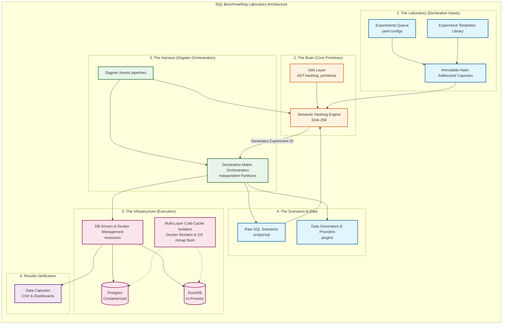

# SQL Benchmarking Laboratory Architecture

Here is the high-level architecture diagram for the project, perfect for a technical presentation.

```mermaid
graph TD
    subgraph "SQL Benchmarking Laboratory Architecture"
        direction TB
        
        subgraph "1. The Laboratory (Declarative Inputs)"
            Queue[Experiments Queue<br/>yaml configs]
            Archive[Experiment Templates Library]
            Configs[Immutable Hash-Addressed Capsules]
            Queue --> Configs
            Archive --> Configs
        end
        
        subgraph "2. The Brain (Core Primitives)"
            Utils[Utils Layer<br/>AST-hashing, primitives]
            Hash[Semantic Hashing Engine<br/>SHA-256]
            Utils --> Hash
        end
        
        subgraph "3. The Harness (Dagster Orchestration)"
            Assets[Dagster Assets pipelines]
            Matrix[Declarative Matrix Orchestration<br/>Independent Partitions]
            Assets --> Matrix
        end
        
        subgraph "4. The Scenarios & Data"
            Scenarios[Raw SQL Scenarios<br/>scripts/sql]
            Plugins[Data Generators & Providers<br/>plugins]
        end
        
        subgraph "5. The Infrastructure (Execution)"
            Resources[DB Drivers & Docker Management<br/>resources]
            Postgres[(Postgres<br/>Containerized)]
            DuckDB[(DuckDB<br/>In-Process)]
            Resources --> Postgres
            Resources --> DuckDB
            ColdStart[Multi-Layer Cold-Cache Isolation<br/>Docker Restarts & OS mmap flush]
            ColdStart -.-> Postgres
            ColdStart -.-> DuckDB
        end
        
        subgraph "6. Results Verification"
            Results[Data Capsules<br/>CSV & Dashboards]
        end
        
        %% Flow of Execution
        Configs --> Hash
        Scenarios --> Hash
        Assets --> Hash
        Hash -- "Generates Experiment ID" --> Matrix
        
        Matrix --> Scenarios
        Matrix --> Plugins
        Matrix --> Resources
        
        Resources --> Results
    end
    
    %% Styling
    classDef default fill:#f9f9f9,stroke:#333,stroke-width:2px;
    classDef input fill:#e1f5fe,stroke:#01579b,stroke-width:2px;
    classDef brain fill:#fff3e0,stroke:#e65100,stroke-width:2px;
    classDef harness fill:#e8f5e9,stroke:#1b5e20,stroke-width:2px;
    classDef infra fill:#fce4ec,stroke:#880e4f,stroke-width:2px;
    classDef result fill:#f3e5f5,stroke:#4a148c,stroke-width:2px;
    
    class Queue,Archive,Configs input;
    class Utils,Hash brain;
    class Assets,Matrix harness;
    class Scenarios,Plugins input;
    class Resources,Postgres,DuckDB,ColdStart infra;
    class Results result;
```
