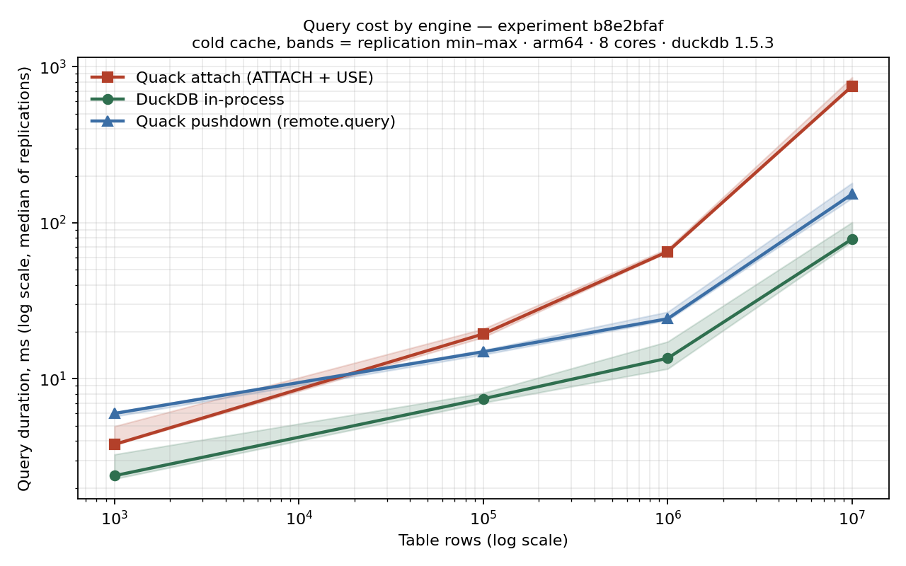
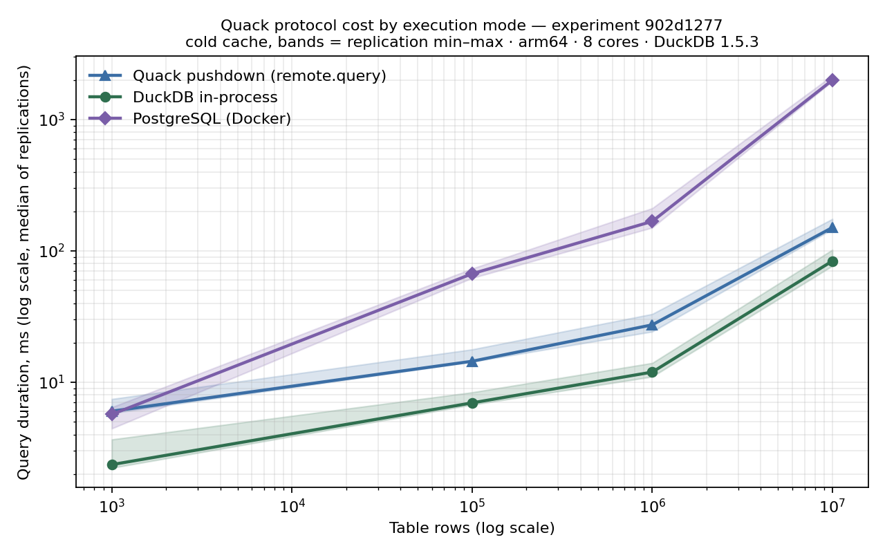
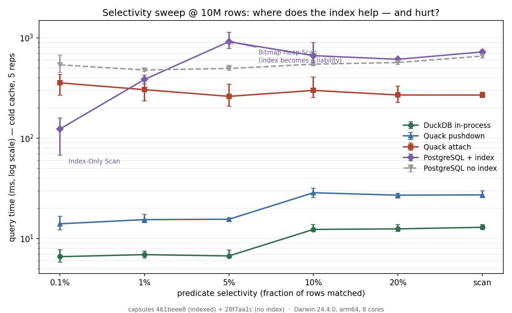

# Published Capsules

*Independent measurements of DuckDB's **Quack** client-server protocol (beta,
v1.5.3), produced by the **sqlbenchdag** lab. Every number here is a committed,
verifiable capsule — re-runnable, integrity-sealed, timestamped, and signed.*

Every published claim cites an 8-character **Experiment ID** — a SHA-256
fingerprint of the experiment's config, SQL, and all measurement-relevant
code. The capsules below are committed in full (`sql_benchmarks/experiments/results/<ID>/`)
so any cited number can be inspected down to its raw replication measurements.

| ID | Experiment | Config | Finding |
|---|---|---|---|
| [`b8e2bfaf`](../sql_benchmarks/experiments/results/b8e2bfaf/) | Quack execution modes | [quack_execution_modes.yaml](../sql_benchmarks/experiments/queue/quack_execution_modes.yaml) | Attach-mode overhead grows with scan size (2.6× @100K → 9.5× @10M rows); pushdown stays flat at ~2×. Mechanism: attach mode streams table data client-side; pushdown ships only results. [Figure](figures/execution_modes_b8e2bfaf.png) |
| [`25b0e134`](../sql_benchmarks/experiments/results/25b0e134/) | Pushdown residual: thread probe | [quack_residual_threads.yaml](../sql_benchmarks/experiments/queue/quack_residual_threads.yaml) | Pushdown's flat ~2× residual matches in-process DuckDB at 2–4 effective threads (of 8) — consistent with reduced parallelism in the server's execution context, not protocol transport. |
| [`902d1277`](../sql_benchmarks/experiments/results/902d1277/) | Quack vs Postgres head-to-head | [quack_vs_postgres.yaml](../sql_benchmarks/experiments/queue/quack_vs_postgres.yaml) | Client-server vs client-server: DuckDB-over-Quack (pushdown, beta) beats Postgres at every scale beyond the noise floor — 4.4× @100K, 6.1× @1M, 13.2× @10M rows. Caveat disclosed in the config: Postgres pays macOS Docker-VM tax on this bench. |
| [`b198363e`](../sql_benchmarks/experiments/results/b198363e/) | TPC-H Q3 validation | [tpch_quack_validation.yaml](../sql_benchmarks/experiments/queue/tpch_quack_validation.yaml) | On canonical dbgen data, pushdown holds ~1.7× on a 3-way join; attach mode cannot execute multi-table joins at all (DNF, "multiple streaming scans not supported" — see duckdb-quack [#150](https://github.com/duckdb/duckdb-quack/issues/150)/[#154](https://github.com/duckdb/duckdb-quack/issues/154)). |

All four: DuckDB 1.5.3 (Quack beta), replication 5, cold cache per query,
idle bench. Full conditions in each capsule's `metadata_<ID>.json`. These four
are the verified set, covered by the signed `sqlbenchdag-quack-v1-20260614` tag.

## Figures

**Protocol cost by execution mode** (capsule `b8e2bfaf`) — attach-mode overhead
climbs with scan size; pushdown tracks in-process DuckDB at a flat ~2×:



**Client-server head-to-head** (capsule `902d1277`) — DuckDB-over-Quack vs PostgreSQL:



## Act 0 — the exploratory origin (historical, *not* in the verified set)

| ID | Experiment | Finding |
|---|---|---|
| [`b82b4eae`](../sql_benchmarks/experiments/results/b82b4eae/) | Quack vs in-process DuckDB (first scout) | Single-replication, two-engine probe that first surfaced the trend: attach-mode overhead *growing* with scan size (2.7× @100K, 4.9× @1M). It motivated the designed experiment `b8e2bfaf`, whose config header still cites it. |

`b82b4eae` is committed so that reference resolves and the scout is inspectable —
but it is deliberately held to a lower bar than the verified set, and you should
treat it accordingly:

- **single replication** (no error bars), only three scale points, no pushdown variant;
- produced under the **pre-migration hashing**, so re-running its config today
  yields a *different* ID — it is re-runnable, not re-derivable to this ID;
- its metadata predates the environment/seed capture, and it is **excluded from
  the signed `sqlbenchdag-quack-v1-20260614` tag**.

It is the lab-notebook entry that came first. The rigorous, verified successor is
`b8e2bfaf`.

## Selectivity study — where an index helps, and where it *hurts*

Two capsules, one question: as a query's `WHERE` clause matches fewer or more
rows, what happens to each engine — and what does giving Postgres a B-tree index
on the filtered column actually buy? The suite filters `skewed_data` to
0.1%–20% of rows (plus a full scan), at 1M and 10M rows, cold cache, 5 reps.

| ID | Config | Postgres | Finding |
|---|---|---|---|
| [`461beee8`](../sql_benchmarks/experiments/results/461beee8/) | [quack_selectivity.yaml](../sql_benchmarks/experiments/queue/quack_selectivity.yaml) | **B-tree index** on `selectivity_code` | The optimizer tipping point, EXPLAIN-verified: Index-Only Scan at 0.1%, Bitmap Heap Scan at 1–5% that is *slower than a seq scan* on cold cache, plain seq scan past ~10%. |
| [`28f7aa1c`](../sql_benchmarks/experiments/results/28f7aa1c/) | **no index** | Flat seq-scan baseline (α≈1.0): selectivity is free information a row-store can't spend without an index. |

The three columnar/Quack lanes (DuckDB, pushdown, attach) below are read from
`461beee8`; the **no-index** Postgres lane is from `28f7aa1c`. Each engine uses
its natural tool — Postgres a B-tree, DuckDB/Quack automatic min-max zonemaps.
Index build happens at ingestion, outside the timed query loop.

Both capsules are integrity-sealed, OpenTimestamped (Bitcoin-anchored), and
covered by the signed `sqlbenchdag-quack-selectivity-v1-20260615` tag.



**Median query time (ms), 1M rows:**

| lane | 0.1% | 1% | 5% | 10% | 20% | scan |
|---|--:|--:|--:|--:|--:|--:|
| DuckDB in-process | 2.1 | 1.6 | 1.6 | 2.3 | 2.8 | 2.7 |
| Quack pushdown | 4.1 | 4.5 | 4.4 | 6.1 | 6.1 | 6.1 |
| Quack attach | 32.3 | 35.4 | 32.2 | 34.5 | 32.6 | 32.6 |
| PostgreSQL + index | 26.4 | 89.9 | 146.3 | 201.3 | 90.0 | 75.7 |
| PostgreSQL no index | 47.5 | 50.6 | 41.2 | 53.4 | 61.7 | 59.1 |

**Median query time (ms), 10M rows:**

| lane | 0.1% | 1% | 5% | 10% | 20% | scan |
|---|--:|--:|--:|--:|--:|--:|
| DuckDB in-process | 6.6 | 6.9 | 6.7 | 12.3 | 12.5 | 12.9 |
| Quack pushdown | 14.0 | 15.4 | 15.6 | 28.6 | 27.0 | 27.2 |
| Quack attach | 355.7 | 304.4 | 261.1 | 299.2 | 269.5 | 269.0 |
| PostgreSQL + index | 123.8 | 384.9 | **915.9** | 664.8 | 611.3 | 723.8 |
| PostgreSQL no index | 537.8 | 478.1 | 494.8 | 546.7 | 567.4 | 658.2 |

Four readings:

1. **The index transforms the selective case** — at 10M/0.1% it cuts Postgres
   from 537.8 → 123.8ms (4.3×) via an Index-Only Scan.
2. **…and becomes a liability at moderate selectivity.** At 10M/5% the planner
   picks a Bitmap Heap Scan (915.9ms) that is *1.85× slower* than the no-index
   seq scan (494.8ms): ~500K cold heap rechecks cost more than reading the table
   sequentially. The index only wins at the extremes of low selectivity — and
   only because the bench is **cold**. A warm cache would flip this; that
   asymmetry is the whole reason the methodology pins cache state.
3. **Even indexed, Postgres never beats in-process DuckDB or pushdown** at these
   scales for `count(*)`. It overtakes only Quack *attach*, and only when
   selective.
4. **Attach stays flat** (~270–356ms at 10M) regardless of selectivity — it
   streams the whole table and filters client-side. The index story is entirely
   a Postgres story; it leaves the Quack-mechanism conclusions untouched.

### Scaling exponent α across selectivity

α is the power-law exponent of query time vs row count (α≈0 flat, 0.5 = O(√N),
1 = linear). Here it is a **two-point slope** (1M→10M, `n_points=2`), so treat it
as a direction, not a fit — a third scale point would be needed for a real
regression. Mean α per lane, and the per-selectivity spread:

| lane | mean α | range across selectivity | reading |
|---|--:|---|---|
| DuckDB in-process | 0.63 | 0.49–0.73 | sublinear — columnar scan |
| Quack pushdown | 0.60 | 0.53–0.67 | sublinear — shares DuckDB's class |
| Quack attach | 0.94 | 0.91–1.04 | ~linear — streams every row |
| PostgreSQL no index | 1.02 | 0.96–1.08 | linear — textbook seq scan |
| PostgreSQL + index | 0.74 | **0.52–0.98** | *no stable class* — see below |

The two "move all the data" lanes (no-index seq scan, attach) scale ~linearly;
the two columnar lanes are sublinear and nearly identical (pushdown inherits
DuckDB's exponent). The indexed Postgres lane is the interesting one: it has
**no single exponent** — its α swings from 0.52 to 0.98 because its *plan*
changes across the matrix (Index-Only → Bitmap → Seq). Indexing doesn't move a
query into a cleaner complexity class; it makes the cost a **piecewise function**
of selectivity and the optimizer's cost crossover. That a single "α" hides three
different algorithms is itself the finding — and an argument for reporting the
plan alongside the exponent.

Regenerate the figure and exponents from the sealed capsules:

```
python scripts/tools/plot_selectivity.py 461beee8 28f7aa1c large
python scripts/tools/analyze_scaling.py 461beee8
```

## What's in a capsule

```
results/<ID>/
├── <ID>.csv                 # flattened matrix: Duration, Duration_Min/Max, DNF per (engine × partition)
├── <ID>.html                # generated dashboard
├── fragments/*.json         # atomic measurements incl. durations_raw (every replication)
├── metadata_<ID>.json       # conditions: engine/Python versions, OS, machine, cores, RAM
├── experiment_config.yaml   # the exact config that ran
├── integrity.seal           # SHA-256 over every capsule file — tamper evidence
├── scaling.json             # per-engine power-law exponent — see note below
└── data_stats/              # generated-data statistics
```

`scaling.json` is a *derived* artifact: it is auto-written into capsules produced
after the feature landed, but for any capsule — including the four published
here, which predate it — the exponents are regenerated on demand from the sealed
raw fragments with `analyze_scaling.py`. The integrity guarantee lives on the
fragments; scaling is reproducible from them, so its presence as a file is a
convenience, not the source of truth.

## The trust chain — verify without trusting me

A benchmark you have to take on faith isn't evidence. Each published capsule
carries four independent guarantees, and you can check every one yourself:

| Guarantee | Required? | Answers | Mechanism | How you check it |
|---|---|---|---|---|
| **Reproducibility** | **Automatic** | Did this question produce this result? | content-addressed Experiment ID | re-run the config → same ID |
| **Integrity** | **Automatic** | Have the bytes changed since publication? | `integrity.seal` (SHA-256 over the capsule) | `verify_capsule.py <ID>` |
| **Timestamp** | **Optional** | Did this exist when claimed — not backdated? | `integrity.seal.ots` (OpenTimestamps → Bitcoin) | `ots verify .../integrity.seal.ots` |
| **Authorship** | **Optional** | Who produced it? | signed git tag | `git verify-tag <tag>` |

Together: **a result you can trust without trusting the person who ran it.** The
two automatic guarantees come free with every run; to add the optional proofs
yourself, see [PUBLISHING.md](PUBLISHING.md).

```
python scripts/dev/verify_capsule.py <ID>     # checks integrity + timestamp
```

To verify authorship after cloning (one-time setup, then `git verify-tag`):

```
git config gpg.ssh.allowedSignersFile .github/allowed_signers
git verify-tag sqlbenchdag-quack-v1-20260614     # → Good "git" signature (release author)
```

The repo ships `.github/allowed_signers` mapping the author's identity to the
public signing key, so the signed `sqlbenchdag-quack-v1-20260614` tag is verifiable by anyone
offline — no GitHub account or trust in GitHub required.

The timestamp proof is trustless — it anchors the seal's hash to the Bitcoin
blockchain, so neither I, nor GitHub, nor anyone can backdate or silently
edit a published result without the proof failing. New capsules are stamped
at publication with `scripts/dev/timestamp_capsule.py` (requires
`opentimestamps-client`); proofs start "pending" and finalize after the next
Bitcoin block via `ots upgrade`.

## Scaling law

Each engine's power-law exponent α (complexity class), fit from a capsule's raw
fragments. Regenerate any of these from the sealed data with:

```
python scripts/tools/analyze_scaling.py <ID>
```

**Published capsules with a row-scaled matrix:**

| Capsule | duckdb (in-process) | quack attach | quack pushdown | postgres |
|---|---|---|---|---|
| `b8e2bfaf` | α=0.35 | α=0.55 (~√N) | α=0.32 | — |
| `902d1277` | α=0.36 | — | α=0.33 | α=0.60 |

The reading: **pushdown shares DuckDB's exponent (~0.32–0.36) — same complexity class,
separated only by a constant (the thread tax); attach mode is a worse class
(√N); and Postgres is worse still (0.60), which is why the head-to-head gap
*widens* with scale.** DuckDB reads ~0.35 in both capsules — an independent
consistency check. (`25b0e134` is a thread sweep and `b198363e` uses
scale_factor, not a row axis, so neither yields a meaningful scaling fit.)

α≈0 is flat, 0.5 is O(√N), 1 is linear. Engines sharing an α but offset by a
constant factor are the same algorithm at different fixed cost; a larger α is a
worse scaling class. (A meaningful fit needs ≥3 scale points — `n_points` is
recorded so two-point fits, which always show R²=1.0, are obvious.)

## How to reproduce

1. **Inspect**: open the capsule — the raw numbers behind every claim are there.
2. **Re-derive**: run the committed config on the same code revision:
   `./run.sh sql_benchmarks/experiments/queue/<config>.yaml --auto`.
   The same question produces the same ID; if code or config drifted, the ID
   changes and the comparison is refused by construction.
3. **Compare across benches**: your absolute milliseconds will differ from ours —
   compare the *ratios*. Your capsule's metadata records your bench, as ours records ours.
